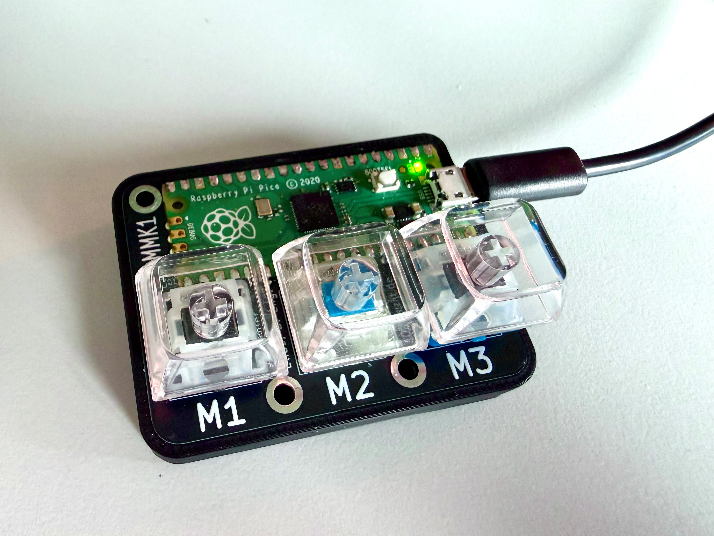

# Mini Macro Keyboard (Raspberry Pi Pico)

[](https://ci.appveyor.com/project/100prznt/minimacrokeyboard)
[](https://github.com/100prznt/MiniMacroKeyboard/releases)
[](https://github.com/100prznt/MiniMacroKeyboard/releases)
[](LICENSE)

Eine kleine USB-Makro-Tastatur auf Basis eines Raspberry Pi Pico, programmiert in
CircuitPython. Der Pico meldet sich am PC als Composite-HID-Gerät (Tastatur +
Maus gleichzeitig) und macht auf einer selbstgebauten 3-Taster-Platine ein paar
wiederkehrende Eingaben und eine kleine Anwesenheitssimulation überflüssig.

Ein Windows-Companion-Programm in C# (`MacroKeyboardSync/`) läuft im Hintergrund
und meldet dem Pico über einen zweiten USB-CDC-Kanal Uhrzeit, die aktuell aktive
Anwendung und den Sperrstatus des PCs.



## Funktionen

Die Platine hat drei Taster (M1–M3), alle gegen GND schaltend:

| Taste | Aktion |
|---|---|
| **M1** | Beim Loslassen: zweizeiliger TODO-Kommentar mit Name/Kürzel und aktuellem Zeitstempel, z. B. `// Mustermann, Max (MM/Abt1) 23.09.2026 10:23:34` gefolgt von einer leeren Kommentarzeile `// ` (Zeilenumbruch per Shift+Enter) |
| **M2** | Beim Loslassen: Text `M2` (Platzhalter, frei anpassbar) |
| **M3** | Kurzer Druck: gibt beim Loslassen die aktuell aktive Anwendung aus (siehe unten). Langer Druck (≥ 0,5 s): schaltet den Mausjiggler sofort um, ohne auf das Loslassen zu warten |
| **M1 + M3** (gleichzeitig) | Gibt einen hinterlegten Text (`TEXT_M4`) + Enter aus – **nur** wenn entweder eine bestimmte Anwendung (in `code.py` festgelegt) im Vordergrund ist oder der PC gerade gesperrt ist. `M2` bleibt davon unbeteiligt |

**Mausjiggler:** Solange aktiv (Standard: direkt nach dem Einschalten), bewegt
sich der Mauszeiger alle 25 Sekunden minimal, um Bildschirmschoner/Abwesend-Status
(z. B. in Teams) zu verhindern. Die Onboard-LED pulsiert währenddessen in einem
Herzschlag-Muster (zwei Auf-/Abdimm-Pulse, kurze Pause, dann eine längere Pause).

**Sync mit dem PC:** Die Companion-App erkennt über die USB-Vendor-ID automatisch
den passenden COM-Port und sendet dem Pico:
- `TIME:` alle 5 Minuten (stellt die Software-RTC des Pico)
- `WIN:` bei jedem Wechsel der aktiven Anwendung (VS, VS Code, KiCad, Opera,
  Explorer, Outlook, GitHub Desktop, Teams, VPN-Client – alles andere
  als `DEFAULT`)
- `LOCK:` bei Sperren/Entsperren sowie als Heartbeat alle 15 Sekunden, damit
  der Pico eine tote Verbindung erkennt

Ohne aktuelle Nachricht vom PC (z. B. direkt nach einem Neustart, bevor die
Companion-App läuft) geht der Pico sicherheitshalber von "gesperrt" aus.

## Hardware

- Raspberry Pi Pico
- Eigene Taster-Platine mit 3 Tastern gegen GND:
  - M1 → GPIO17
  - M2 → GPIO26
  - M3 → GPIO28

## Repo-Struktur

```
src/boot.py       Aktiviert den zweiten USB-CDC-Datenkanal (usb_cdc.data)
src/code.py       Hauptprogramm: Taster-Logik, HID-Ausgabe, Mausjiggler, Sync
src/macros.py     Anpassbare Texte/Konstanten (TEXT_M2, TEXT_M4, TODO_SIGNATURE)
install/          CircuitPython-UF2 für den Pico (de_DE)
MacroKeyboardSync/ Windows-Companion-App (C#, .NET 8)
```

## Einrichtung (Pico)

1. [CircuitPython](https://circuitpython.org/board/raspberry_pi_pico/) auf den
   Pico flashen (die passende UF2-Datei liegt auch in `install/`).
2. `adafruit_hid` aus dem
   [Adafruit CircuitPython Bundle](https://circuitpython.org/libraries) in
   `lib/` kopieren.
3. Für ein deutsches Tastaturlayout zusätzlich `keyboard_layout_win_de.py` und
   `keycode_win_de.py` aus
   [Neradoc/Circuitpython_Keyboard_Layouts](https://github.com/Neradoc/Circuitpython_Keyboard_Layouts)
   nach `lib/` kopieren.
4. `boot.py`, `code.py` und `macros.py` aus `src/` auf das `CIRCUITPY`-Laufwerk
   kopieren (alle drei ins Root, `macros.py` muss neben `code.py` liegen).
5. `macros.py` an die eigenen Texte anpassen (Name/Kürzel für M1, Text für die
   M1+M3-Combo).

## Einrichtung (Companion-App)

1. `MacroKeyboardSync/` mit .NET 8 SDK bauen (`dotnet build` bzw. Visual
   Studio).
2. Die App beim Windows-Systemstart starten lassen (z. B. Autostart-Ordner
   oder Aufgabenplanung) – sie läuft ohne Konsolenfenster im Hintergrund.
3. Erkannte Anwendungen sind in der `KnownApps`-Dictionary in `Program.cs`
   hinterlegt und lassen sich dort um weitere Prozessnamen ergänzen.

## Hinweis zur M1+M3-Combo

Der bei `TEXT_M4` hinterlegte Text ist bei mir persönlich durch ein Passwort
ersetzt, das nur bei passender Anwendung bzw. gesperrtem PC getippt wird. Wer
das Repo als Vorlage nutzt: Der Wert liegt aktuell als Klartext in `macros.py`
auf dem Flash-Speicher des Pico – bei physischem Zugriff auf das Gerät ist er
auslesbar. Für den privaten Gebrauch an einem einzelnen, vertrauenswürdigen
Rechner ist das ein bewusst akzeptiertes Risiko, kein Ersatz für einen echten
Passwortmanager.

## Lizenz

Dieses Projekt steht unter der [MIT-Lizenz](LICENSE).
